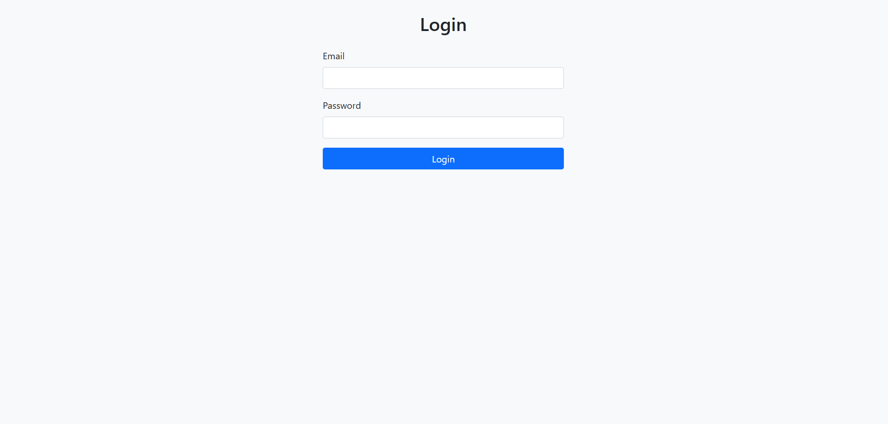
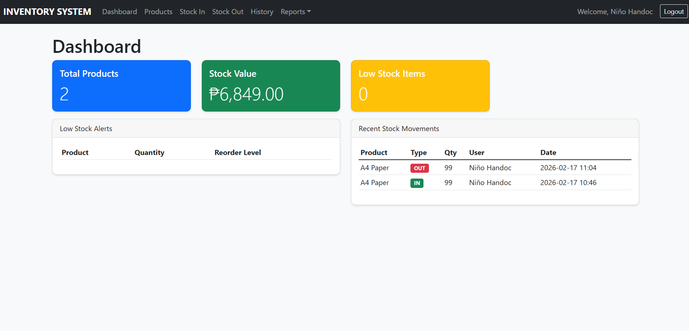

# 📦 Inventory Management System

A simple and secure **Inventory Management System** built using **PHP, MySQL, Bootstrap 5, and JavaScript**.


🚀 Features

* Secure login & logout (password hashing)
* Role-based access (Admin & Staff)
* Product management (CRUD)
* Stock In / Stock Out
* Dashboard with charts and low-stock alerts
* Transaction history
* CSRF protection & prepared statements


🛠 Tech Stack

* PHP 8+
* MySQL (PDO)
* Bootstrap 5
* Chart.js
* DataTables
* XAMPP (Apache)


🔐 Login Page





---

📊 Dashboard



```


⚙️ Installation

1️.Clone Repository

bash
git clone https://github.com/yourusername/inventory-system.git


2️.Move to XAMPP

Place the folder inside:

C:\xampp\htdocs\


3️.Setup Database

* Start Apache & MySQL in XAMPP
* Open phpMyAdmin
* Import `inventory.sql`


4. Open in Browser

http://localhost/INVENTORY-MANAGEMENT-SYSTEM


